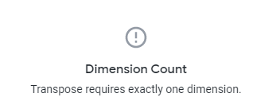

# Naming Convention

Looker, by definition, performs a simple conversion of the name of the field to its label in the UI.

```
dimension: some_name_dimension {}
```

Will be shown in the UI as `Some Name Dimension`. The following steps are taken:

1. Replace underscores with spaces
2. Capitalize the words

### Labels

Looker has five ways to manipulate the representation of a field in the UI and the code:

1. Name of the field itself (dimension: \<name> {)
2. `label` parameter
3. `group_label` parameter
4. `group_item_label` parameter
5. `description` parameter

#### Name

Name of the field is how you're going to reference those fields anywhere in your code and Table Calculations. For example:

```
dimension: full_name {
  label: "Short"
}
```

In Lookml and Table Calculations, you will still have to reference it as `${full_name}`

#### Label

This parameter manipulates how the field is going to look like in the Field Picker and Data Table. For example:

```
dimension: country_currency {
  label: "Currency"
}
```

Will be displayed as **Currency**

.png>).png>)

However, in a Table Calculation, you still have to refer to it by full name




#### Group Label

Group label allows us to either group dimensions and measures together under a name that exlains all of them (come from the same source or are of the same data type) or simply by reducing the length of the name.

.png>)

Above, you can see several dimensions grouped under the name **Hubspot**. The definitions of the fields, however, still contain prefix hubspot, so that we can identify the data easily in the code or reference it.&#x20;

There could be more than one **Account Manage**r field coming from different sources, hence the field would be defined as follows:

```
dimension: hubspot_account_manager {
  group_label: "Hubspot"
  group_item_label: "Account Manager"
}
```

#### Group Item Label

As you can see in the previous example, we used **Group Item Label** parameter not **Label**.

#### Description

This parameter is used if a bit more detail is needed to explain this field, where it came from, how it was created, or simply what it means if abbreviations are used in the name. It will be displayed when a user hovers over the field and clicks the :information\_source: icon

.png>)

### Dimensions

### Measures

Always add a prefix to your measures to make it known what is the type of the measure:

* `total_value`
* `average_discount`
* `count_companies`

:exclamation:It will not apply for some measures, for example ratios and rates :exclamation:

In case there are many measures of one type, use a group label but still keep the original name of the field.

```
measure: total_value {
  group_label: "Totals"
  group_item_label: "Value"
}
```

The above will show the field as **Value** under **Totals** group but in the code, data table, and internally, you will have to reference it as `total_value`. This is desired because field names have to be unique.

### Percentages

For values that are represented as percentages, we add two things:

* in the name of the field, add suffix `_pct`
* in the label add a sign `%`

```
measure: active_companies_pct {
 label: "Active Companies %"
}
```

### Monetary values

All monetary values in Looker that are represented as USD are to have "clean" versions of its name:

* `outstanding_book_value`
* `revenue`
* `gross_amount`
* `net_funded`

That is because primarily we will be dealing with USD values. However, if there's a need to show values in different currencies, add a suffix `_local` to the field

* `outstanding_book_value_local`
* `revenue_local`
* `gross_amount_local`
* `net_funded_local`

It makes it known for the user that they also need to use currency field to have the right context of the values.
